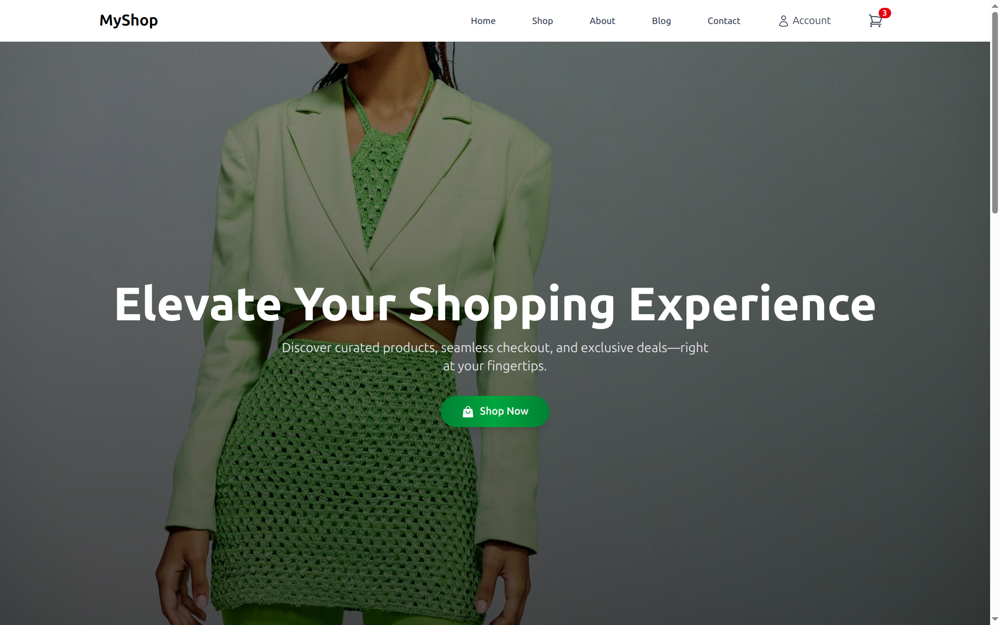
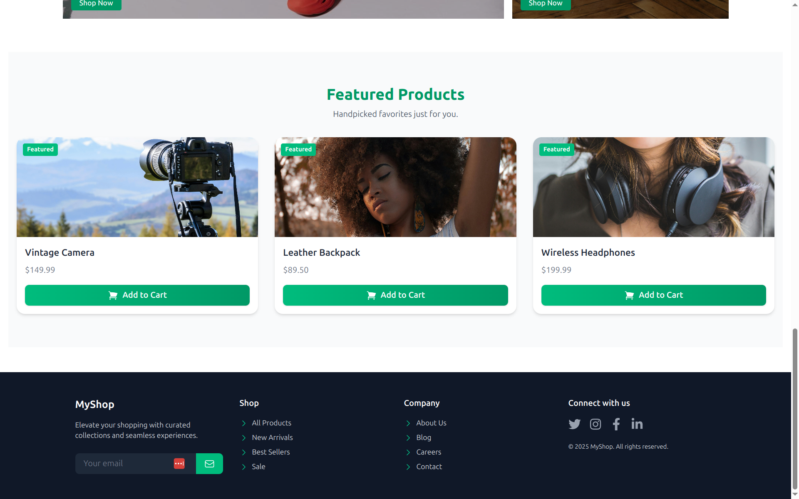
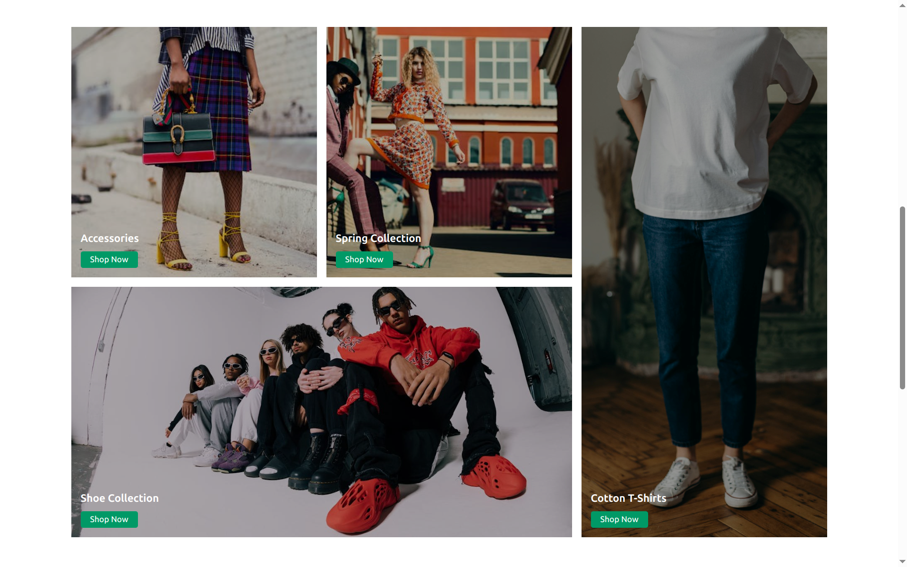

# 🌿 MyShop E-Commerce Demo

A **stunning**, **responsive**, and **feature-rich** e-commerce sample built with React 19, TypeScript 5.7, Vite 6.3, Tailwind 4.1, Motion for React 12.9, Headless UI 2.2, and Heroicons 2.2.  
This project showcases modern frontend best practices, accessible UI patterns, and polished animations—perfect for your portfolio or interview walkthrough.

---

## 🚀 Key Features

- **✨ Immersive Hero Section**  
  Full-bleed background image with gradient overlay, Motion entrance animations, and a colorful gradient CTA button.

- **🛍️ Featured Products**  
  Mock API data, Context API cart management, animated product cards with “Featured” ribbons, and “Add to Cart” buttons.

- **🧩 Irregular Grid Showcase**  
  Magazine-style mosaic layout pulling random Unsplash imagery for eye-catching promotions.

- **🔗 Responsive Navbar & Footer**  
  Headless UI Disclosure & Menu for accessible mobile menus, React Router v7.5 routing, and social icons via React Icons.

- **⚙️ Modern Tooling**  
  Vite for fast dev & build, Tailwind CSS for utility-first styling, TypeScript for type safety, and zero-config deploy to Vercel/Netlify.

---

## 🛠️ Tech Stack

| Layer            | Libraries & Versions               |
| ---------------- | ---------------------------------- |
| **Framework**    | React 19.0.0, React DOM 19.0.0     |
| **Bundler**      | Vite 6.3.1, @vitejs/plugin-react   |
| **Language**     | TypeScript 5.7.2                   |
| **Styling**      | Tailwind 4.1.4, @tailwindcss/vite  |
| **Routing**      | react-router-dom 7.5.2             |
| **Animations**   | motion for React 12.9.1            |
| **UI & Icons**   | @headlessui/react 2.2.2, @heroicons/react 2.2.0, react-icons |

---

## 📁 Project Structure

```
src/
├── assets/                   # Static images (hero.jpg, screenshots, etc.)
├── components/               # Reusable UI pieces
│   ├── Hero/                 # Hero.tsx + styles
│   ├── Navbar/               # Navbar.tsx
│   ├── Footer/               # Footer.tsx
│   ├── ProductCard/          # ProductCard.tsx
│   ├── FeaturedProducts/     # FeaturedProducts.tsx
│   └── IrregularGrid/        # IrregularGrid.tsx
├── hooks/                    # useCart.tsx (Context API)
├── pages/                    # HomePage.tsx, ShopPage.tsx, etc.
├── services/                 # products.ts (mock API)
├── types/                    # index.ts (Product, CartItem)
├── App.tsx                   # Routes & Layout wrapper
└── main.tsx                  # Entrypoint (CartProvider & ReactDOM)

public/
└── index.html
tailwind.config.js
vite.config.ts
tsconfig.json
README.md
screenshots/                  # Put your three screenshots here
```

---

## 📷 Screenshots

  
*Immersive full-screen hero with gradient overlay and animated CTA.*

  
*“Featured Products” section with motion-animated cards and emerald accents.*

  
*Magazine-style mosaic layout showcasing promotions.*

---

## 🚀 Getting Started

1. **Clone your fresh repo**  
   ```bash
   git clone https://github.com/<YOUR_USERNAME>/myshop-portfolio.git
   cd myshop-portfolio
   ```

2. **Install dependencies**  
   ```bash
   npm install
   ```

3. **Run in development**  
   ```bash
   npm run dev
   # ➜  http://localhost:5173
   ```

4. **Build for production**  
   ```bash
   npm run build
   ```

---

## 📦 Deploy to Vercel / Netlify

- **Vercel**:  
  1. Install Vercel CLI: `npm install -g vercel`  
  2. Run `vercel` and follow prompts.

- **Netlify**:  
  1. Push to GitHub  
  2. Connect repo via Netlify UI  
  3. Set build command: `npm run build`, publish dir: `dist/`.

---

## 🌟 Push to GitHub

```bash
# Initialize & commit
git init
git add .
git commit -m "Initial portfolio e-commerce demo"

# Create & push to GitHub (using GH CLI)
gh repo create myshop-portfolio --public --source=. --remote=origin
git branch -M main
git push -u origin main
```

*Or create your repo manually at* https://github.com/new *and then:*  
```bash
git remote add origin https://github.com/<YOUR_USERNAME>/myshop-portfolio.git
git push -u origin main
```

---

## 🤝 Contributing & License

Feel free to **fork**, **star**, and **customize** this template.  
Licensed under the [MIT License](LICENSE).

---

*Crafted with ❤️ using React, TypeScript, Tailwind, and Motion.*

